# Yatzi (JavaFX)

- [Getting Started](#getting-started)
  * [Setup Environment](#setup-environment)
  * [Setup Java FX](#setup-javafx-with-gradle)
  * [Debugging](#debugging)
- [User Interface](#user-interface)
  * [Java FX](#javafx)
  * [Screen Types](#screen-types)
  * [Screen Helper](#screen-helper)
  * [Image Handling](#image-handling)
- [Engine](#yatzigame)
  * [Yatzi Game](#yatzigame)
  * [Board](#board)
- [Networking](#networking-javanet)
  * [Implementation](#implementation)
  * [Server](#server)
  * [Client](#client)
  * [Data Transfer](#data-transfer)
  * [Protocol Functions](#transfer-functions)
- [Yatzi Project]()
  * [Naming Conventions](#naming-conventions)
  * [Sonarqube](#static-code-testing-with-sonarqube)
  * [Design Guidelines](#identity)


|                                                |                                                         |
| ---------------------------------------------- | ------------------------------------------------------- |
| 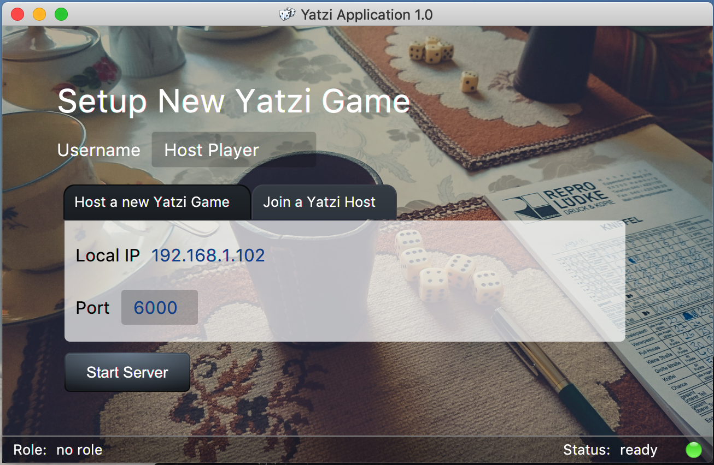         | 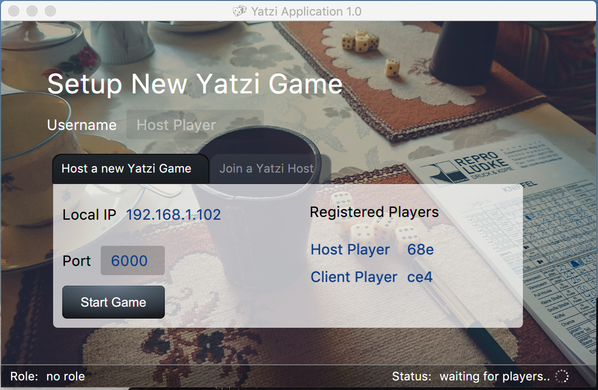  |
| 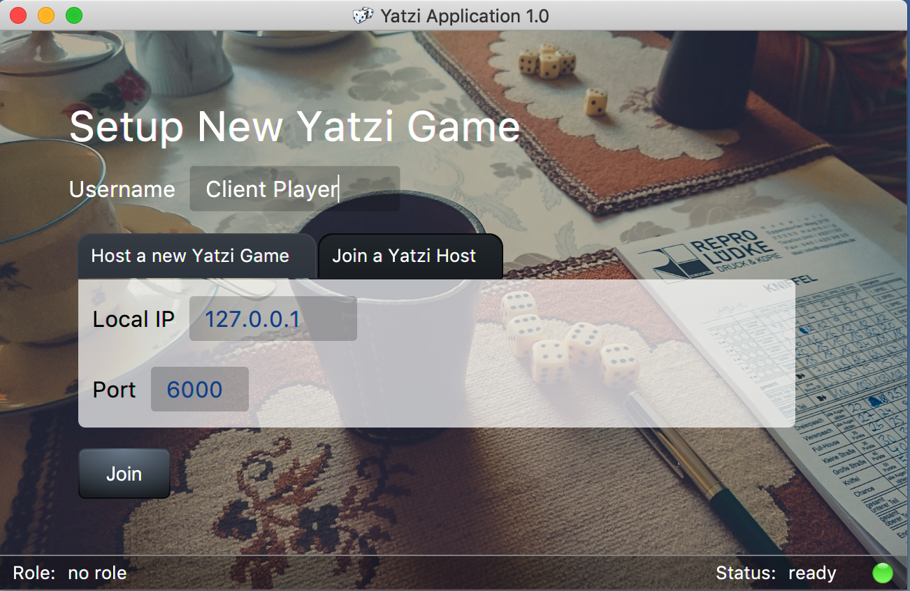           | 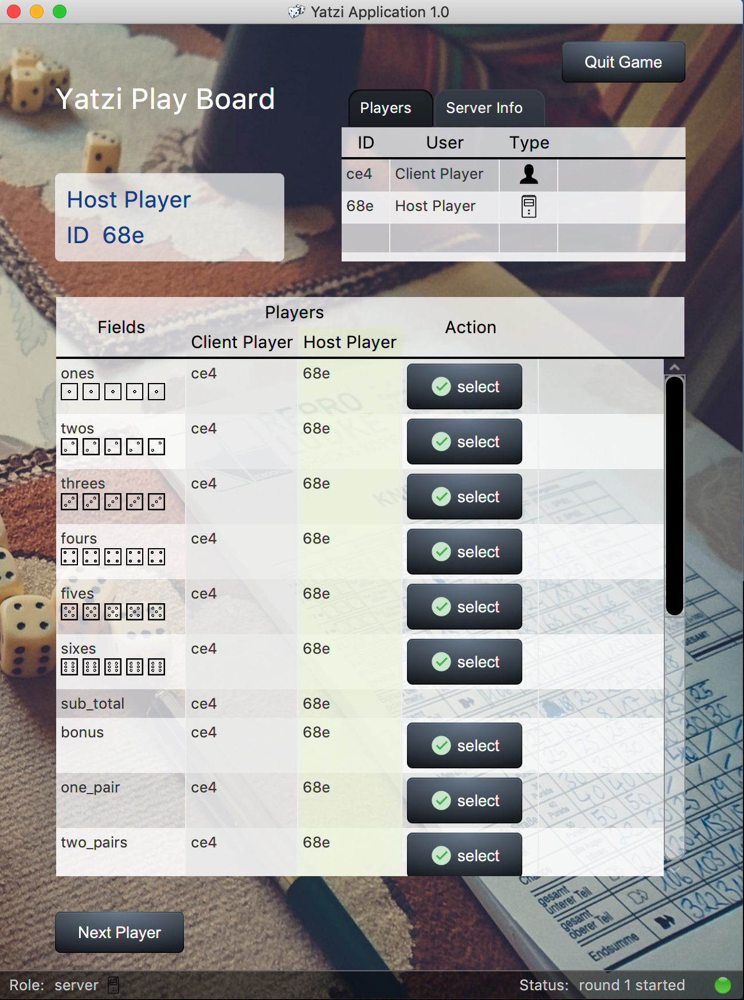  |
  

## Getting Started

Read the `JavaDoc` at: https://s-schizophrene-trio.github.io/yatzi/

### Setup Environment

* Install Gradle 5.3.1+
* Install JDK 11.0.2
* Download JavaFX 11


### Setup JavaFX with gradle

https://openjfx.io/openjfx-docs/#gradle -> JavaFX and IntelliJ -> Non-modular with Gradle

#### Debugging

If you get this Error Message in IntelliJ...
```
Error: JavaFX runtime components are missing, and are required to run this application
```
You have to set some VM Options
```
--module-path /path/to/your/javafx-sdk-11.0.2/lib --add-modules=javafx.controls,javafx.fxml
```

## User Interface

### Application Architecture

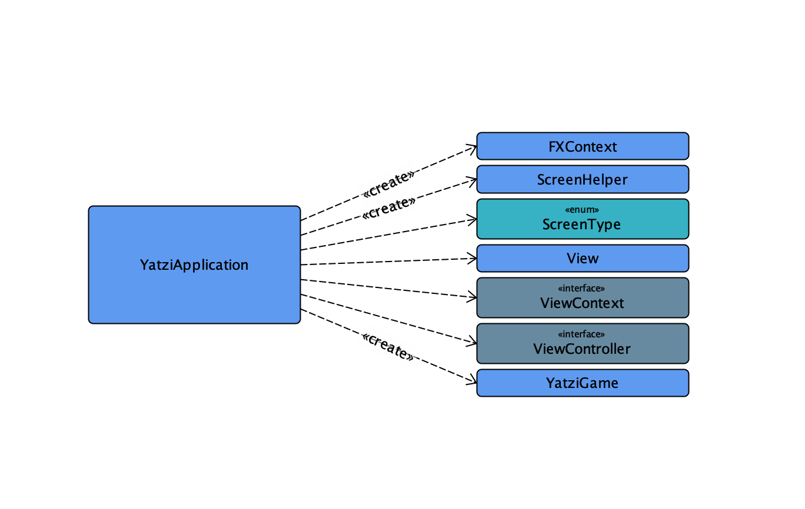

### JavaFX

* https://openjfx.io/javadoc/11/javafx.graphics/javafx/scene/doc-files/cssref.html

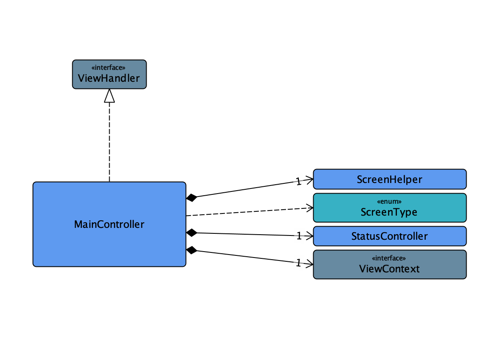

`MainController` is used to build, load and display a view. He is also used to initialize the board logic. 

`ScreenType` is an enum with all available Screens. Each `ScreenType` has to be implemented in the `loadScreen` method 
of the `MainController`

### Screen Types

| Type   | Description                                                                                 |
|--------|---------------------------------------------------------------------------------------------|
| BOARD  | The board view is the main view used for the yatzi game.                                |
| SETUP  | The setup view is used to initialize the game mode. The User can join or create a server. |
| STATUS | The status bar will be added on each view and can be access from each controller.         |


The `YatziApplication`, an instance of `javafx.application.Application` creates a global `ch.juventus.yatzi.ui.models.FXContext` which holds the 
main stage and the game instance of the application. The context will be accessed over the `ViewContext` interface. 
The context instance will be shared with the `MainController`. This is necessary to adapt the window-size
and other global attributes. Each `ScreenController` holds also an instance of the `ViewContext`. This means every 
component has access to global `ViewContext` and its child values. 

### Screen Helper

The `ScreenHelper` class can be loaded by a javaFX class and have access to the main stage.

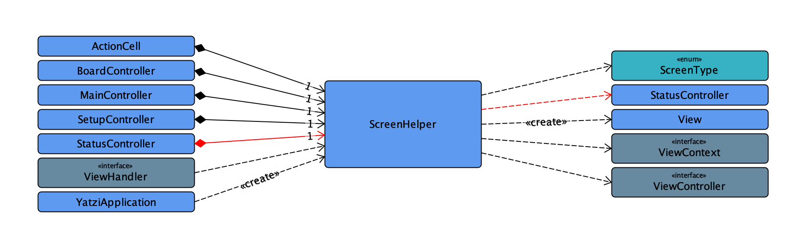

### Image Handling

#### Icons

* https://icons8.de/icon/set/server/ios
* https://icons8.de/icon/25226/verbunden
* http://www.holshousersoftware.com/glass

#### Get a Java Image from Resources

If you want to load an image from resource folder inside a `ScreenController`, use following methods.

```
// @param classloader The classloader of the context to access ressources
// @param subPath The sub-path in the base image folder eg. "icons/"
// @param key filename (lowercase)
// @param fileExt file ending eg. "png"
// @return A String with the relative image path
screenHelper.getImage(classloader, subpath, imageKey, fileExt)

//sample:
Image image1 = screenHelper.getImage(this.context.getClassloader(), "background/", "board_background", "jpg");

// render a image view based on this image:
ImageView imageView1 = screenHelper.renderImageView(context.getClassloader(), "icons/", "server", "png")
ImageView imageView1 = screenHelper.renderImageView(context.getClassloader(), "icons/", "server", "png", 200, 200)
```

### Naming Conventions

```
Logs
------------------------------------------------------------------
* all characters should be written in lowercase
* LOGGER.debug("application started in {}ms", elapsedTime);

Comments
------------------------------------------------------------------
// the whole comment should be written in lowercase

JavaDoc
------------------------------------------------------------------
/**
 * Describes the funcionality of the method.
 * @param param1 Each Text should start with a Uppercase Character
 * @param param2 Each Parameter has to be described
 * @return Describes the Return Value
 */
 public String testMethod(String param1, String param2) {
    return new String("test-string");
 }
```

## YatziGame

The Yatzi Game is a full instance of a game. This Object can be used on multiple clients. The communication 
between message handlers, allows the developer to to make async calls.

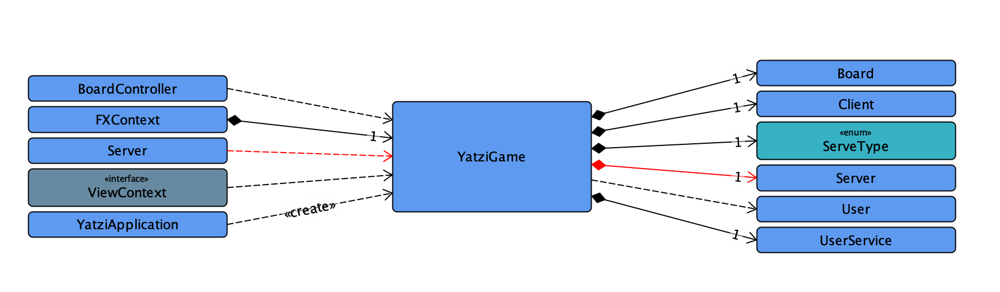

## Board

The Board represents the play ground of this game. The board knows all users and the state of the game.

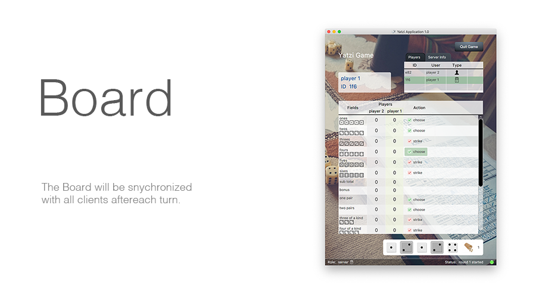

## Networking (java.net)

By definition, a socket is one endpoint of a two-way communication link between two programs running on different computers on a network. A socket is bound to a port number so that the transport layer can identify the application that data is destined to be sent to.

__Sources__

* https://www.baeldung.com/a-guide-to-java-sockets

### Implementation

#### Overview

```
+---------------------------------------------------+
|                                                   |
|   Player 1 (Host)                                 |
|                                                   |
|           +-----------------+                     |
|   +-----> | Message Handler | <-------------+     |
|   |       +-----------------+               |     |
|   |                                         |     |
|   |                 +------------+      +---+--+  |
|   |   +-----------> |   Client   +----> | CT 1 |  |
|   |   |             +------------+      +------+  |
|  ++---+---+                                X      |          +-------------------------------------------+
|  |  Game  |                               TCP     |          |                                           |
|  ++---+---+                                X      |          |  Player 2                                 |
|   |   |             +------------+      +------+  |          |                                           |
|   |   +-----------> |   Ser|er   +----> | CH 1 |  |          |                   +-----------------+     |
|   |                 +------------+      +--+----  |          |       +---------> | Message Handler |     |
|   |                                        |      |          |       |           +---------------+-+     |
|   |                +-----------------------+      |          |       |                           ^       |
|   |                |                              |          |       |                           |       |
|   |                |                    +------+  |          |   +---+--+     +--------+       +-+----+  |
|   |                |  +-----------------+ CH 2 |XX|XXXX_TCP_X|XXX| CT 1 | <---+ Client | <-----+ Game |  |
|   |                |  |                 +------+  |          |   +------+     +--------+       +------+  |
|   |                |  |                           |          |                                           |
|   |                |  |                           |          +-------------------------------------------+
|   |                |  |                           |
|   |                v  v                           |          +-------------------------------------------+
|   |                                               |          |                                           |
|   |        +-----------------+          +------+  |          |  +------+     +--------+       +------+   |
|   +------> | Message Handler | <--------+ CH n |XX|XXX_TCP_XX|XX| CT 1 | <---+ Client | <-----+ Game |   |
|            +-----------------+          +------+  |          |  +---+--+     +--------+       +-+----+   |
|                                                   |          |      |                           |        |
+---------------------------------------------------+          |      |                           v        |
                                                               |      |           +---------------+-+      |
                                                               |      +---------> | Message Handler |      |
                                                               |                  +-----------------+      |
                                                               |                                           |
                                                               |                                           |
                                                               |  Player n                                 |
 CT = Client Task                                              |                                           |
 CH = Client Handler                                           +-------------------------------------------+
```

#### Server

The Server holds all `client handlers`, and handles all messages bundled to one `message handler`.

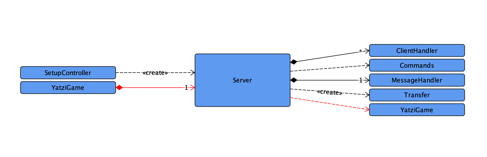

Each new client will effect in a new `client handler` thread. 

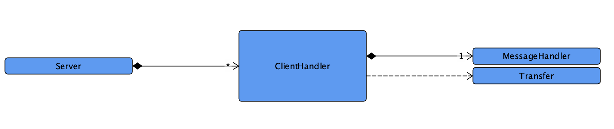

#### Client

The Client connects to a `server socket` and will be a member or player of the game.

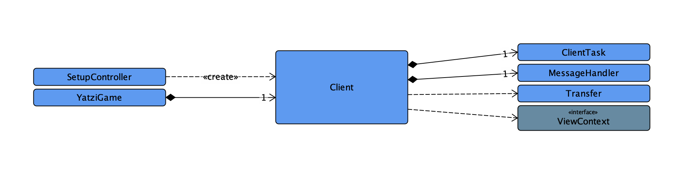

The `client` crates a new task to handle the `server <-> client` connection.

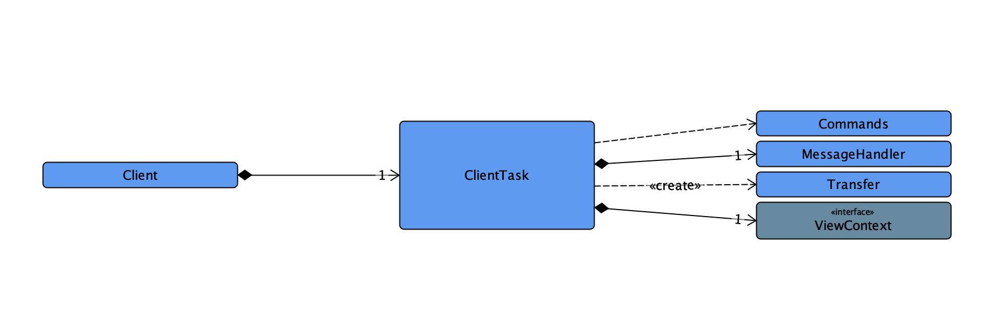

### Data Transfer

| Attribute | Type   | Description                                                                          |
|-----------|--------|--------------------------------------------------------------------------------------|
| Sender    | UUID   | UUID of the sender user / client. The server does not need to provide the Sender ID. |
| Function  | String | Defines the reason for this network transfer.                                        |
| Body      | String | The needed Model translated to a JSON String                                         |
| Sent Time | Date   | Time when the transfer object was sent to the network.                               |

#### Transfer Functions

| Command             | Description                                                            | Body      |
|---------------------|------------------------------------------------------------------------|-----------|
| PLAYER_NEW          | A new player will join the the game.                                   | User      |
| MAX_PLAYERS_REACHED | The maximum of clients is reached.                                     | -         |
| WAIT_FOR_GAME_READY | The server is waiting for new players to join.                         | -         |
| GAME_READY          | The server has started the game.                                       | -         |
| CLIENT_READY        | The client is ready to start a new game.                               | -         |
| DICE_CHANGED        | The dice set has been changed.                                         | Dice[]    |
| ROUND_START         | Starts a new round of the game.                                        | YatziGame |
| GAME_CHANGED        | The game has been changed. (includes the currently active user)        | YatziGame |
| PLAYER_EXIT         | A player leaves the game early.                                        | User Id   |
| GAME_END            | The game is finished. The user can exit the game or start a new party. | -         |

#### Communication Flow
Each client opens a new connection to the server. The server tries to keep alive these connections. This is needed 
to prevent latency during game play due of connection establishing.


_https://www.oreilly.com/library/view/distributed-computing-in/9781787126992/assets/ea864328-5b66-4620-9dd8-9005c5af7986.png_

#### Client Handling
This Yatzi Game (Host) is able to manage multiple Clients (max 7). To make this possible, the Server
creates for each incoming Client a new Client Handler Thread. 


_https://cdncontribute.geeksforgeeks.org/wp-content/uploads/JavaSocketProgramming.png_

### Build & Ship Info

* [How to run the application with gradle - stackoverflow](https://stackoverflow.com/a/52571719/5242747)

#### Static Code testing with SonarQube

```
$ docker-compose up
$ ./gradlew sonarqube \
   -Dsonar.host.url=http://localhost:9000 \
   -Dsonar.login=<your-token>
```

### Identity

__Colors__

* yatzi-blue: __#113f89__
* yatzi-gray: __#dbdbdb__
